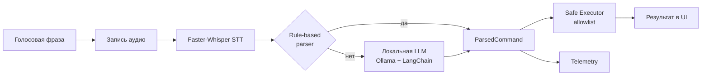

# Voice Assistant для Windows

Локальный голосовой ассистент на Python, который превращает короткую русскую фразу в безопасное действие на ПК.

Проект задуман как практичный desktop-ассистент: нажали кнопку, произнесли команду, получили результат без облачных сервисов и без магии, которую нельзя проверить.

## В двух словах о сути

Это гибрид из трех уровней:

1. Распознавание речи (Faster-Whisper) превращает аудио в текст.
2. Разбор намерения (правила + локальная LLM через Ollama) определяет действие.
3. Безопасный исполнитель запускает только разрешенные команды из белого списка.

Итог: ассистент понимает естественные формулировки, но не выполняет произвольные shell-команды.

## Что умеет

- Слушать команду с кнопки и по горячей клавише Ctrl+Space.
- Записывать короткий фрагмент с микрофона (по умолчанию 4 секунды).
- Распознавать русскую речь офлайн через Faster-Whisper.
- Разбирать команду rule-based парсером и при необходимости подключать локальную LLM.
- Открывать приложения и сайты, выполнять поиск в Google.
- Показывать распознанный текст, статус и результат прямо в UI.
- Собирать локальную телеметрию (и опционально отправлять события в Langflow).

## Поддерживаемые действия

- Открыть Блокнот: открой блокнот
- Открыть Калькулятор: открой калькулятор
- Открыть браузер: открой браузер
- Открыть Google или YouTube
- Поиск: найди в гугле прогноз погоды на завтра
- Открыть сайт: открой сайт github
- Открыть приложение: открой steam
- Напечатай текст: в текущей версии это заглушка (показывается в результате)

## Архитектура потока



## Технологический стек

- Python 3.11-3.12 (рекомендуется)
- PySide6 (настольный интерфейс)
- Faster-Whisper (офлайн STT)
- LangChain + Ollama (локальный LLM-разбор)
- Локальные логи и статистика для наблюдаемости

## Быстрый старт (Windows)

1. Установите Python 3.11 или 3.12.
2. Создайте виртуальное окружение.
3. Установите зависимости.
4. Запустите приложение.

PowerShell:

```powershell
python -m venv .venv
.\.venv\Scripts\Activate.ps1
python -m pip install -r requirements.txt
python main.py
```

Command Prompt:

```bat
python -m venv .venv
.\.venv\Scripts\activate.bat
python -m pip install -r requirements.txt
python main.py
```

## Настройки

Основные параметры находятся в файле app/config.py.

STT:

- FASTER_WHISPER_MODEL
- FASTER_WHISPER_DEVICE
- FASTER_WHISPER_COMPUTE_TYPE
- FASTER_WHISPER_BEAM_SIZE
- FASTER_WHISPER_LANGUAGE

LLM:

- USE_LOCAL_LLM
- OLLAMA_URL
- OLLAMA_MODEL
- OLLAMA_TIMEOUT_S
- OLLAMA_NUM_PREDICT
- LLM_DESKTOP_PROMPT_MAX_CHARS

Телеметрия:

- LANGFLOW_ENABLED
- LANGFLOW_ENDPOINT_URL
- LANGFLOW_API_KEY
- LANGFLOW_FLOW_ID
- LANGFLOW_TIMEOUT_S
- LANGFLOW_EVENTS_FILE
- LANGFLOW_STATS_FILE

## Локальная LLM и fallback-логика

Если включена USE_LOCAL_LLM, ассистент отправляет распознанный текст в локальную модель и ожидает строгий JSON-ответ с action/payload.

Если модель недоступна, вернула ошибку или невалидный формат, приложение продолжает работу через rule-based поведение и не выполняет ничего вне белого списка.

## Безопасность

- Нет выполнения произвольных shell-команд.
- Только заранее разрешенные действия.
- Все LLM-решения дополнительно ограничены allowlist-подходом в исполнителе.

## Логи и наблюдаемость

- События: logs/langflow_events.jsonl
- Сводная статистика: logs/langflow_stats.json

Это удобно для анализа качества распознавания, времени выполнения и успешности команд в реальных сценариях.

## Структура проекта

```text
app/
	audio/          # запись с микрофона
	stt/            # распознавание речи
	commands/       # разбор намерений (rule-based + LLM)
	executor/       # безопасный исполнитель команд
	ui/             # PySide6 интерфейс
	observability/  # логирование и телеметрия
```

## Почему этот проект полезен

Voice Assistant закрывает практичную задачу: быстрые голосовые действия на Windows без зависимости от облака. Это хорошая база для дальнейшего развития:

- добавить новые команды;
- расширить сценарии автоматизации;
- улучшить NLU-пайплайн;
- подключить более глубокую аналитику качества.

Если коротко: это не демо-игрушка, а аккуратный фундамент для локального голосового помощника, который можно развивать под реальные ежедневные задачи.
